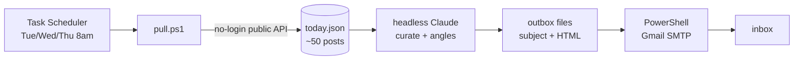

# LinkedIn Engagement Agent

An automated agent that finds fresh, on-topic LinkedIn posts worth commenting on and emails a curated shortlist — each with a suggested **angle** — so an operator spends ten minutes engaging instead of an hour hunting. The human still writes and posts every comment; the agent only does the discovery and the strategic prep.

> **Status:** working in production for one user (3x/week, ~$3.60/month). This repo is a sanitized, config-driven template for evaluation.

---

## The problem it solves

Consistent, thoughtful LinkedIn commenting builds professional visibility and inbound interest. But the step that actually eats time — and the reason people quit — is *discovery*: finding fresh, relevant posts from the right people before the thread goes cold. And you can't just script it: LinkedIn's fresh content sits behind a login wall, and public search engines lag it by 2+ months.

This agent removes the discovery cost while keeping a human in control of the voice.

## What it does

Three mornings a week, with zero interaction:

1. **Pulls** ~50 fresh LinkedIn posts across your target topics — via a **no-login public-data API**, so your own LinkedIn account is never used or logged in.
2. **Filters** out recruiter/promo/event noise and **picks the best 5**, split across your goals (e.g. 2 for a professional lane, 3 for a business-development lane).
3. **Writes an angle** for each with an LLM (Claude) — a 2–3 sentence strategic point, *not* a canned comment.
4. **Emails** the shortlist to your inbox.

You open the email, click through, and write the comments in your own voice.

## Architecture

| Stage | How |
|-------|-----|
| Schedule | Windows Task Scheduler (local; catches up if the machine was off) |
| Discovery | Apify no-login LinkedIn post-search actor (public data only) |
| Curation | Headless Claude Code (`claude -p`), authed with a long-lived subscription token |
| Delivery | Gmail SMTP (app password) |
| Secrets | All in environment variables — **nothing sensitive is stored in this repo** |

## Cost

~**$3.60/month**, inside the Apify free tier ($5/mo). The Claude token and Gmail send are free. No servers, no infrastructure — it runs on one machine.

## Setup

~15 minutes. See **[SETUP.md](SETUP.md)**: create a free Apify account, generate a Claude token, create a Gmail app password, copy `config.example.ps1` → `config.ps1`, run `scripts/register-task.ps1`.

**Want your own, on your topics?** Hand **[recreate-with-claude.md](recreate-with-claude.md)** to Claude Code — it's a ready-to-paste prompt that walks you through the whole setup for your two lanes.

## The code (for review)

Plain PowerShell plus one text brief — quick to read through:

- [`scripts/pull.ps1`](scripts/pull.ps1) — Stage 1: fetch + pre-filter fresh posts
- [`scripts/curate-prompt.txt`](scripts/curate-prompt.txt) — the brief handed to the LLM (persona is editable)
- [`scripts/run-daily.ps1`](scripts/run-daily.ps1) — orchestrates pull → curate → email → send
- [`scripts/register-task.ps1`](scripts/register-task.ps1) — one-time: registers the scheduled task
- [`config.example.ps1`](config.example.ps1) — the settings you'd fill in
- [`SETUP.md`](SETUP.md) — step-by-step setup
